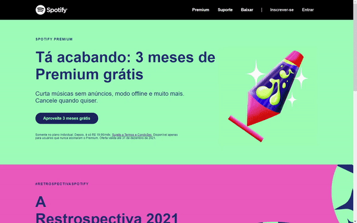

<h1 align="center">
  SPOTIFY COVER
</h1>
<h1 align="center">
  
</h1>

---

## 🚀 Tecnologias utilizadas

- HTML
- CSS
- SASS

---

## 📁 Como baixar o projeto

```bash
  # Clone o reposítorio
  $ git clone https://github.com/guixavier77/spotify-cover.git
  # após a clonagem executar o arquivo index.html
```

---

<h1 align="center">
   ETAPAS
</h1>

✔ PAGINA INICIAL

<h1 align="center">
  ⚙ PROJETO EM ANDAMENTO...
</h1>
Desenvolvido por Guilherme Xavier. 💻
